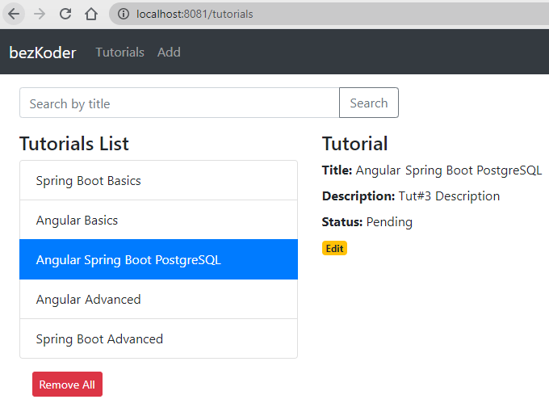

# Spring Boot + Angular + PostgreSQL CRUD example

Full-stack Angular + Spring Boot + PostgreSQL CRUD Aplicacion Tutorial en el que:
- Cada Tutorial tiene id, title, description, published status.
- Podemos crear, obtener, actualizar, borrar Tutorials.
- Tambien podemos encontrar Tutorials por titulo.



## Frontend
Angular 20.1.6

## Herramientas

| Tecnologia | Version |
| ---- | --- |
| Node.js | ^20.19.0 \|\| ^22.12.0 \|\| ^24.0.0 |
| Typescript | >=5.8.0 <5.9.0 |
| RxJS | ^6.5.3 \|\| ^7.4.0 |

### Puerto del servicio
8084

### Instalar dependencias
```bash
cd angular-17-client
```

```bash
npm install
```

### Construir el proyecto
```bash
ng build
```

## Ejecutar el proyecto
```bash
ng serve --port 8084
```

## Backend
Spring Boot 3.3.13

### Herramientas
| Tecnologia | Version |
| ---- | --- |
| JDK | 21.0.4 o superior |
| Maven | 3.6.3 o superior |
| Postgres | 14.0 o superior|

### Credenciales de la base de datos
| | |
| -- | -- |
| Base de datos | grupo04 |
| Usuario | grupo04 |
| Password | .grupo04.grupo04 |
| Puerto | 5432 |
| Host | localhost |

Es necesario crear una base de datos `grupo04`, la aplicacion se encarga de crear la tabla

### Puerto del servicio
8085

> Para cambiar el puerto, agregar o modificar los valores en `/src/main/resources/application.properties` la propiedad `server.port=8085` con el puerto a utilizar

### Construccion del proyecto
```bash
cd spring-boot-server
```

```bash
mvn package
```

### Ejecucion del proyecto
```
mvn spring-boot:run
```

### Endpoints

Base Url [http://localhost:8085](http://localhost:8085)

| Método | Endpoint        | Descripción                 |
|--------|-----------------|-----------------------------|
| GET    | `/api/tutorials`    | Lista todos los tutoriales    |
| POST   | `/api/tutorials`    | Crea un nuevo tutorial       |
| GET    | `/api/tutorials/:id`| Obtiene un tutorial por ID   |
| PUT    | `/api/tutorials/:id`| Actualiza un tutorial        |
| DELETE | `/api/tutorials/:id`| Elimina tutorial          |

### Configuracion de Nginx
```
listen       3000;
server_name  localhost;

### Locacion si solo queremos hacer correr un deploy en nginx
location / 
{
    root   C:/nginx/html/Angular20/browser;
    index  index.html index.htm;
		
    error_page   500 502 503 504  /50x.html;
     location = /50x.html 
     {
        root   html;
     }
}

### Locacion si queremos usar 3 deploy en nginx
``` # DEV environment
        location /dev/ {
            alias  C:/nginx/html/Angular20/dev/;
            index  index.html;
            try_files $uri $uri/ /index.html;
        }

        # TEST environment
        location /test/ {
            alias   C:/nginx/html/Angular20/test/;
            index  index.html;
            try_files $uri $uri/ /index.html;
        }

        # STAGING environment
        location /staging/ {
            alias   C:/nginx/html/Angular20/staging/;
            index  index.html;
            try_files $uri $uri/ /index.html;
        }